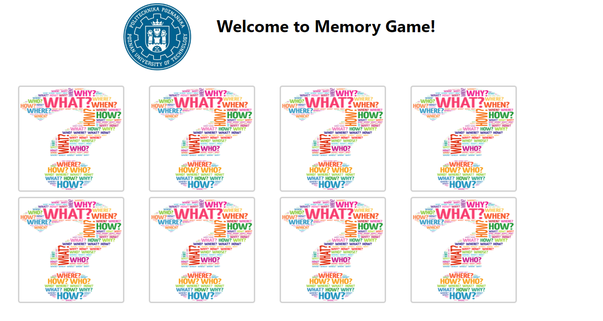

# Polibuda Memory Game  

Polibuda Memory Game jest to prosta gra pamięciowa oparta na frameworku React. Została ona opracowana z myślą o pierwszorocznych studentach wydziału Elektroniki i Telekomunikacji Politechniki Poznańskiej by ułatwić im szybsze rozpoznawanie władz wydziału. 

Projekt zrealizowano w ramach Akademickiego Koła Aplikacji Internetowych (AKAI) na Politechnice Poznańskiej.  

 
Powyżej znajduje sie ekran powitalny. Po przejsciu do gry pojawią się karty.
 

Projekt można uruchomić poprzez:
### `npm start`
